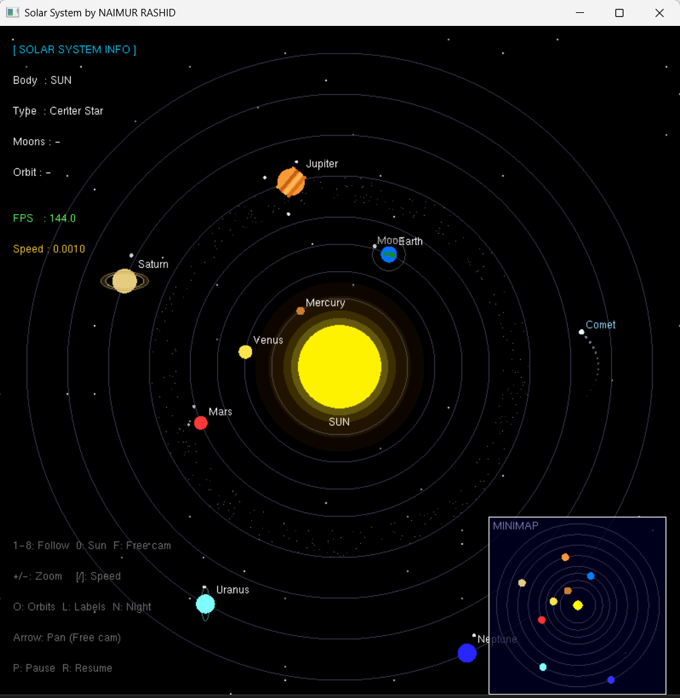
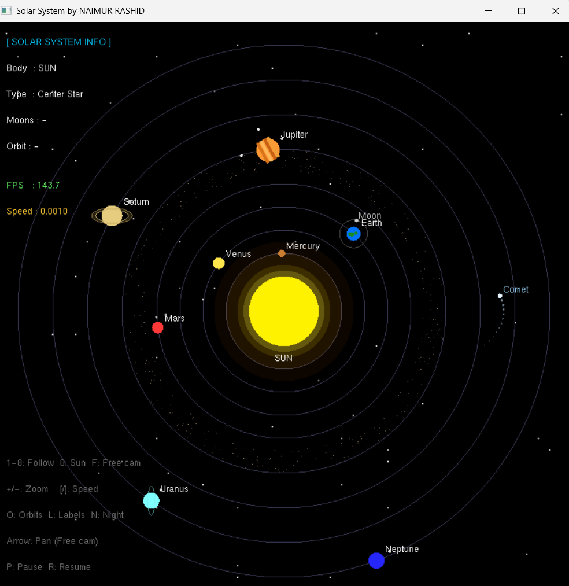
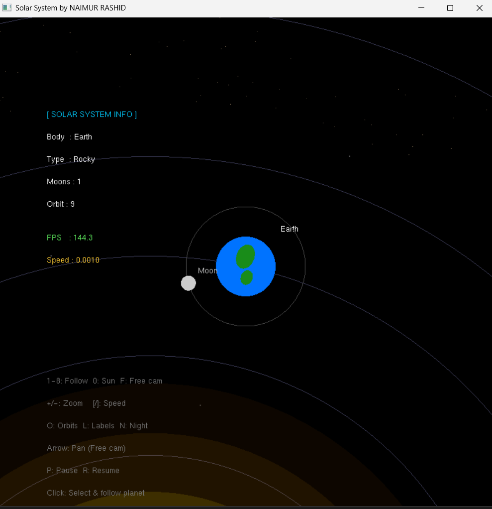
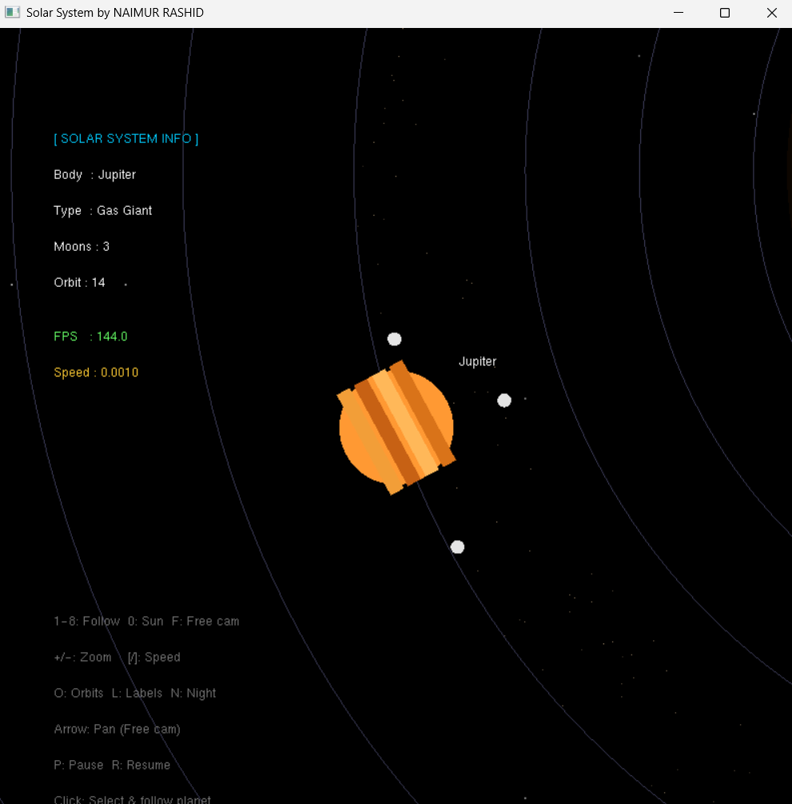
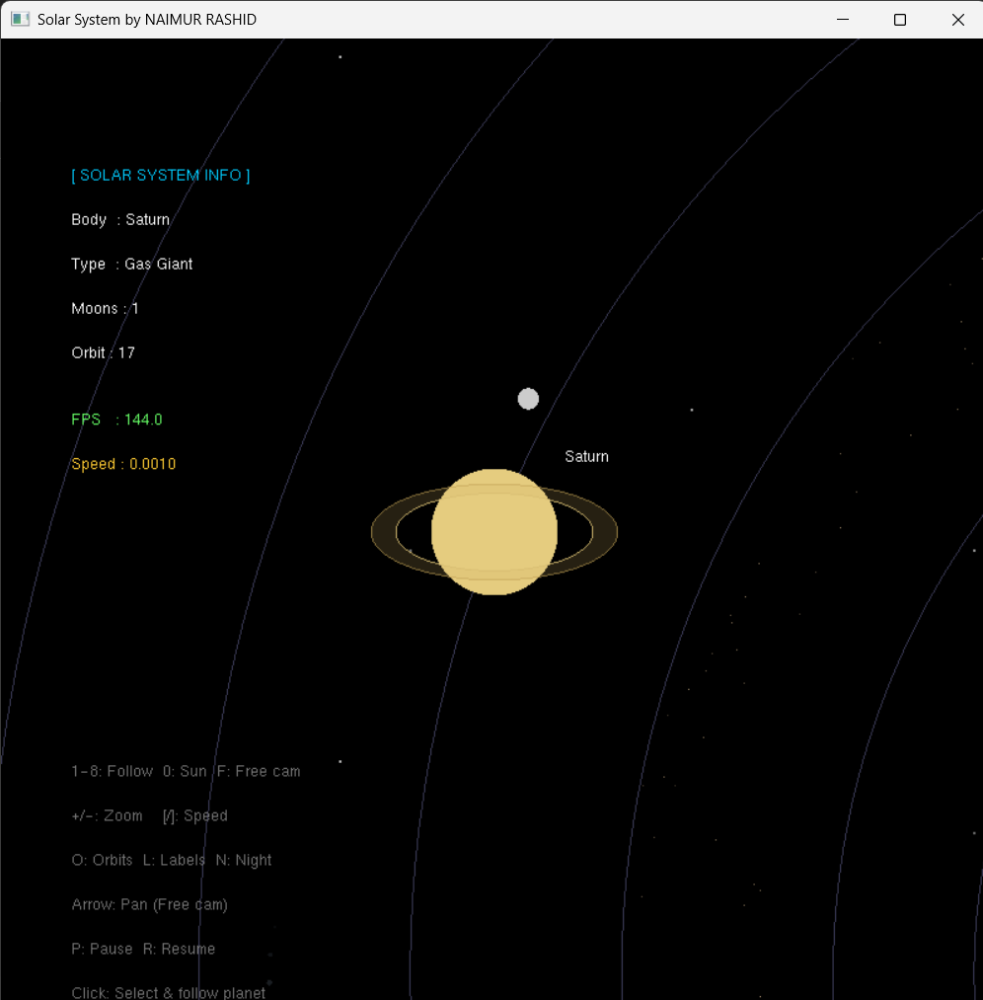

# OpenGL Solar System

A Computer Graphics project developed using **C++**, **OpenGL**, and **GLUT**.  
This project simulates a real-time animated solar system with interactive camera controls, planet following, zoom, speed control, and a detailed info panel.

---

## Features

- Real-time planet rotation around the Sun with individual orbital speeds
- Moon rotation around Earth, Mars, Jupiter, Saturn, Uranus, and Neptune
- Smooth camera follow — click any planet to follow it
- Zoom in/out with smooth interpolation
- Free camera pan mode with arrow keys
- Adjustable animation speed (pause, resume, increase/decrease)
- Toggle orbit paths, planet labels, and night mode
- Sun glow pulse animation and star twinkle effect
- Animated comet with glowing tail
- Asteroid belt between Mars and Jupiter
- Jupiter cloud bands and Earth continent detail
- Saturn double ring with semi-transparent fill
- Uranus tilted ring
- Real-time FPS and speed display in info panel
- Semi-transparent info panel with planet details
- Click-to-select planet with mouse

---

## Technologies Used

| Technology | Description |
|------------|-------------|
| C++ | Core programming language |
| OpenGL | Graphics rendering API |
| GLUT (FreeGLUT) | Window and event management |
| Computer Graphics | Mathematical animation and trigonometry |

---

## Mathematical Concept Used

Planet rotation uses circular motion equations:

$$x = r \cos(\theta)$$
$$y = r \sin(\theta)$$

Where:

- `r` = orbit radius
- `θ` = rotation angle (incremented each frame to animate motion)

Each planet has a different angular multiplier to simulate varying orbital speeds.

---

## Project Structure

```text
OPENGL-SOLAR-SYSTEM/
│
├── .vscode/
│
├── bin/
│   └── Debug/
│       └── OpenGL-Solar-System.exe
│
├── obj/
│
├── screenshots/
│   ├── solar-system-with-minimap.png
│   ├── solar-system-without-minimap.png
│   ├── closeViewEarth.png
│   ├── closeViewJupiter.png
│   └── closeViewSaturn.png
│
├── src/
│   └── main.cpp
│
├── OpenGL-Solar-System.cbp
├── OpenGL-Solar-System.depend
├── OpenGL-Solar-System.layout
├── README.md
└── .gitignore
```

---

## How to Run

### Compile

```bash
g++ src/main.cpp -o solar -lfreeglut -lopengl32 -lglu32
```

### Run

```bash
./solar
```

---

## Output Screenshots

### Full Solar System View


### Without Minimap


### Close View — Earth


### Close View — Jupiter


### Close View — Saturn


---

## Keyboard & Mouse Controls

| Key / Input | Action |
|-------------|--------|
| `1` – `8` | Follow Mercury → Neptune |
| `0` | Follow / center on Sun |
| `F` | Free camera mode |
| `+` | Zoom in |
| `-` | Zoom out |
| `[` | Decrease speed |
| `]` | Increase speed |
| `P` | Pause animation |
| `R` | Resume animation |
| `O` | Toggle orbit paths |
| `L` | Toggle planet labels |
| `N` | Toggle night mode |
| Arrow Keys | Pan camera (Free cam mode only) |
| Left Click | Select and follow clicked planet |

---

## Function Reference

### `void init()`
Initializes OpenGL state — sets background color to black, enables alpha blending, and calls `applyProjection()` to set up the initial orthographic view.

---

### `void applyProjection()`
Sets the orthographic projection matrix using current `zoom` and `camX`/`camY` values. Called every frame after camera updates to reflect zoom and pan changes.

```
glOrtho(-zoom+camX, zoom+camX, -zoom+camY, zoom+camY, -1, 1)
```

---

### `void circle(GLfloat rx, GLfloat ry, GLfloat cx, GLfloat cy)`
Draws a filled ellipse (or circle when `rx == ry`) using `GL_TRIANGLE_FAN`.  
Used for: Sun, all planets, moons, comet head, comet tail segments.

---

### `void orbit(float radius)`
Draws a circular orbit ring using `GL_LINE_LOOP`.  
Used for: all 8 planetary orbits and Earth's moon orbit.

---

### `void drawText(float x, float y, const char* text)`
Renders a string of text at world-space coordinates using `glutBitmapCharacter` with `GLUT_BITMAP_HELVETICA_12`.  
Used for: planet labels, info panel text, controls hint.

---

### `float dist2(float ax, float ay, float bx, float by)`
Returns the Euclidean distance between two 2D points.  
Used in `mouse()` to find which planet the user clicked on.

---

### `void updateCamera()`
Updates `camX` and `camY` to follow the selected planet based on `followPlanet` index.  
- `followPlanet == 0` → center on Sun (0, 0)  
- `followPlanet == 1..8` → center on the respective planet  
- `followPlanet == -1` → free cam, arrow keys control `camX`/`camY`

---

### `void drawInfoPanel()`
Draws the semi-transparent info panel in the top-left corner of the screen (world-space anchored to the left/top edge).

Displays:
- Selected body name, type, moon count, orbit radius
- Current FPS (green)
- Current animation speed (yellow)
- Controls hint box at the bottom-left

Line height is clamped to a minimum so text stays readable at high zoom levels.

---

### `void Draw()`
Main rendering function — called every frame by GLUT's display callback.

Rendering order (back to front):
1. Recalculate all planet positions using trigonometry
2. Call `updateCamera()` and `applyProjection()`
3. Clear screen
4. Draw stars (random seeded points with twinkle)
5. Draw orbit rings (if `showOrbits`)
6. Draw asteroid belt (random seeded points rotating slowly)
7. Draw Sun with glow layers and pulse animation
8. Draw Mercury, Venus
9. Draw Earth with continent detail + Moon
10. Draw Mars + 2 moons (Phobos, Deimos)
11. Draw Jupiter with cloud bands + 3 moons
12. Draw Saturn with double elliptical ring + 1 moon
13. Draw Uranus with tilted ring + 1 moon
14. Draw Neptune + 1 moon
15. Draw animated Comet with fading tail
16. Draw Info Panel (`drawInfoPanel()`)
17. Swap buffers and update FPS counter

---

### `void mouse(int button, int state, int x, int y)`
Handles left mouse click — converts screen pixel coordinates to world-space coordinates, then finds the nearest planet within a hit radius. On hit: sets `selectedPlanet`, `followPlanet`, and `targetZoom` to focus on that body.

---

### `void keyboard(unsigned char key, int x, int y)`
Handles regular key input:
- `+` / `-` → adjust `targetZoom`
- `[` / `]` → adjust `speed`
- `P` / `R` → pause / resume
- `O` / `L` / `N` → toggle orbits / labels / night mode
- `F` → free cam mode
- `0`–`8` → follow planet by index

---

### `void specialKeys(int key, int x, int y)`
Handles arrow key input for free camera pan mode (`followPlanet == -1`).  
Each press moves `camX` or `camY` by `zoom * 0.08f`, so pan speed scales naturally with zoom level.

---

### `void update()`
GLUT idle callback — called as fast as possible between frames.

Updates per frame:
- Increments `angle` by `speed` (drives all planet positions)
- Increments `selfRotate` (Earth and Jupiter self-rotation)
- Increments `cometAngle`
- Smoothly interpolates `zoom` toward `targetZoom` at 5% per frame
- Animates `sunPulse` (oscillates between 0 and 0.45)
- Animates `starBrightness` (oscillates between 0.3 and 1.0 for twinkle)
- Wraps `angle` back to 0 after a full revolution

---

## Planet Details

| Planet | Orbit Radius | Speed Multiplier | Moons |
|--------|-------------|-----------------|-------|
| Mercury | 5 | 1.8× | 0 |
| Venus | 7 | 1.5× | 0 |
| Earth | 9 | 1.0× | 1 (Moon) |
| Mars | 11 | 0.8× | 2 (Phobos, Deimos) |
| Jupiter | 14 | 0.5× | 3 |
| Saturn | 17 | 0.4× | 1 |
| Uranus | 20 | 0.3× | 1 |
| Neptune | 23 | 0.2× | 1 |

---

## Future Improvements

- [ ] Planet textures using OpenGL texture mapping
- [ ] Realistic lighting and shading (Phong model)
- [ ] Galaxy / nebula background
- [ ] Pluto and dwarf planets
- [ ] More accurate moon counts
- [ ] 3D perspective projection
- [ ] Sound effects

---

## GitHub Upload Commands

```bash
git init
git add .
git commit -m "Initial commit - OpenGL Solar System"

git branch -M main

git remote add origin https://github.com/YOUR_USERNAME/OpenGL-Solar-System.git

git push -u origin main
```

---

## Submitted By

**MD Naimur Rashid**
